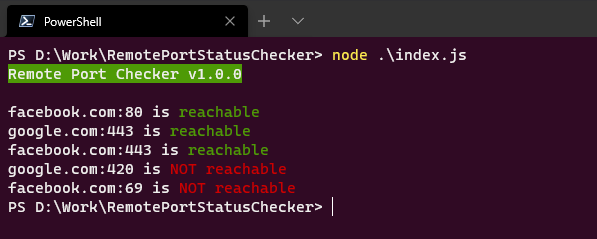

# RemotePortStatusChecker
A configurable command-line utility to test if local or remote ports on a host are reachable.

## Problem

Everytime the cloud infrastructure team deploys a new environment or rebuilds an existing environment, I have to check on each deployed VM host that certain TCP ports are whitelisted and are reachable from my client. (Using `telnet` to check the connectivity for each port seems slow)

## Solution

Enter the hostname and port numbers of all the hosts in the `hostsInformation.json` file, whose "reachability" needs to be tested.


For example, if I want to test if the ports `443, 80, 1433 and 25` are reachable for `my.azure.vm.one` and `my.azure.vm.two`, I'll add the following entries in `hostsInformation.json`

```(json)
{
  "hosts": [
    ...
    {
      "hostname": "my.azure.vm.one",
      "ports": [
        443,
        80,
        1433,
        25
      ]
    },
    {
      "hostname": "my.azure.vm.two",
      "ports": [
        443,
        80,
        1433,
        25
      ]
    }
  ]
}
```

The utility iterates over the list of hosts using [is-reachable](https://www.npmjs.com/package/is-reachable) and displays the result.


